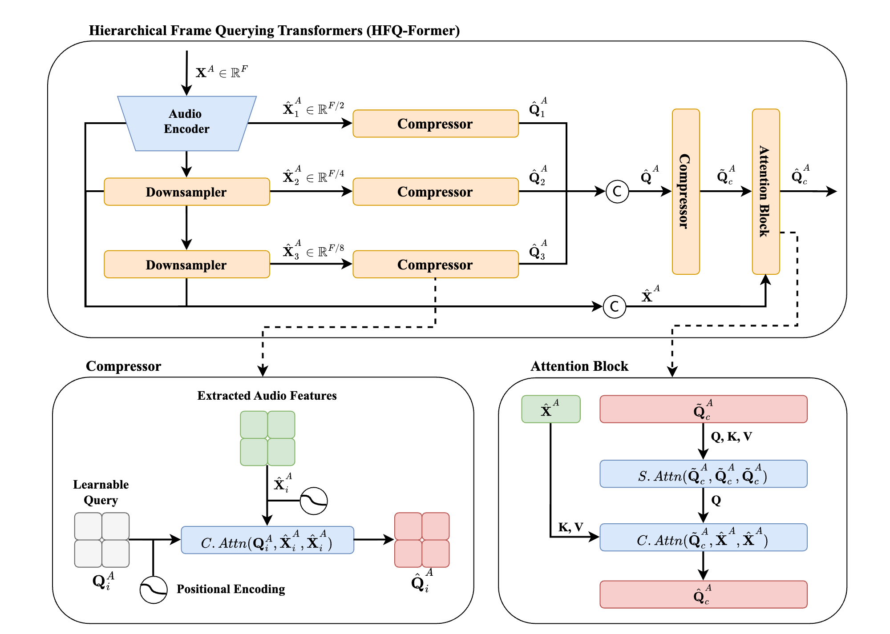

# 🚀 FastALM: Hierarchical Frame Q-Former for Effective Audio Modality Adaptation
FastALM is a **lightweight Audio-Language Model (ALM)** designed to efficiently handle **long-form audio inputs**.

## 🌟 Features
- 🔊 **HFQ-Former**: Hierarchically compresses high-frame-rate audio features while preserving context
- ⚡ **3-Stage Training**: Cost-effective and fast training strategy
- 🧠 **LLM Adaptation**: Adapts pre-trained LLMs to the Audio modality
<!-- -->    


<!-- 📦 Installation
 ```bash
git clone https://anonymous.4open.science/r/FastALM-1D6B
cd FastALM
pip install -r requirements.txt
```-->

## 📥 Load Model
Model weights available [here](https://drive.google.com/file/d/16LjeG4fMe7ABnb0_k47JjF6V5dweN3Zw/view?usp=sharing)
```python
import torch
import torchaudio
from models.model import FastALM

model = FastALM(
    embed_dim=2560, # LLM hidden size
    speech_dim=1280, # Audio Encoder hidden size
    lora=True, # LoRA activate
    lora_r=16, # LoRA Rank
    lora_a=64, # LoRA alpha
    compression_size=50, # Audio token length
).cuda()

check_point = torch.load"your_path/Stage3_FastALM.pt"
model.load_state_dict(check_point["model_state_dict"])
```


## 🎤 Sample Inference

```python
# 1. Load audio
wav_path = "sample_audio/English_audio.wav"
wav, sample_rate = torchaudio.load(wav_path)

# 2. Resample to 16 kHz (required by FastALM)
resampler = torchaudio.transforms.Resample(orig_freq=sample_rate, new_freq=16000)
audio = resampler(wav).cuda()

# 3. Prepare the prompt
# Task Token exists 4 task
# Automatic Speech Recognition: <|ASR|>
# Automatic Speech Translation: <|AST|>
# Speech Summarization: <|SSUM|>
# Spoken Query-based Question Answering: <|SQQA|>
task_token = "<|ASR|>"
audio_tokens = "<|audio_bos|><AUDIO|><|audio_eos|>"
basic_prompt = f"{task_token}{audio_token}\nTranscribe this audio clip into text."
prompt = [{"role": "user", "content": basic_prompt}]

# 4. Apply chat template
conversation = model.tokenizer.apply_chat_template(
    prompt,
    add_generation_prompt=True,
    tokenize=False
)
print("Conversation template:", conversation)

# 5. Tokenize
token = model.tokenizer(conversation, return_tensors='pt').input_ids.cuda()

# 6. Perform inference
model.eval()
with torch.no_grad():
    with torch.cuda.amp.autocast(dtype=torch.bfloat16):
        output = model.generate(
            input_ids=token,
            audio=audio
        )

# 7. Print the transcription result
print("Generated output:", output[0])

```
