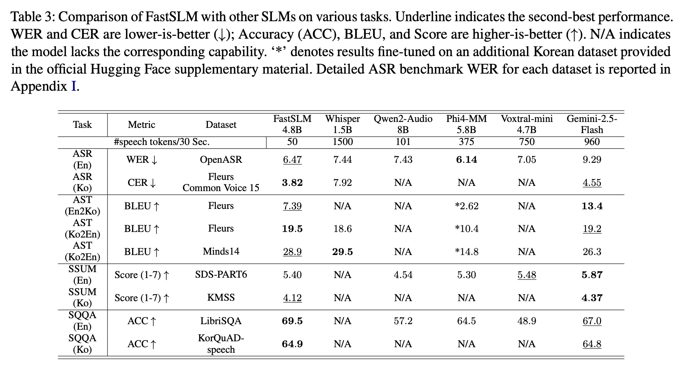
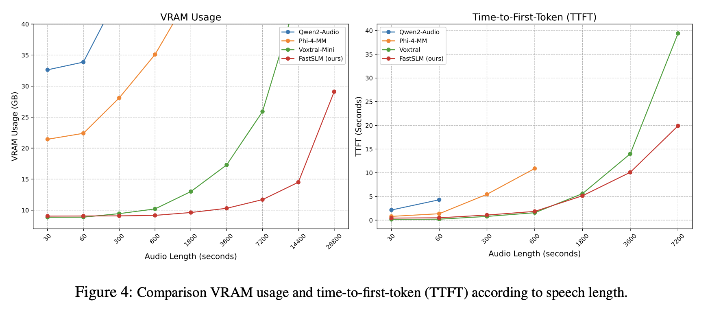
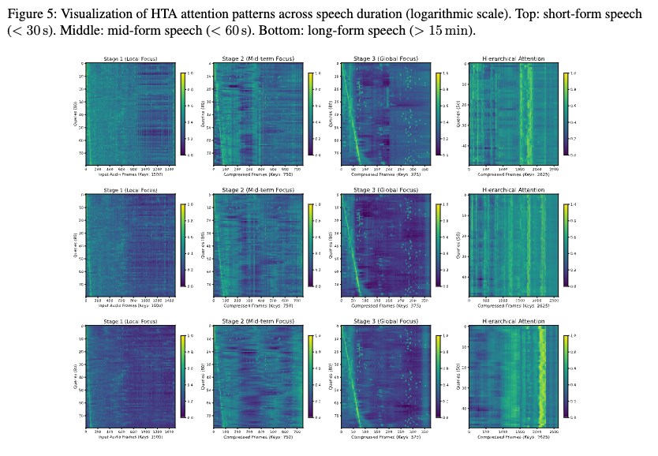

# 🚀 FastSLM: Hierarchical Temporal Abstraction for Efficient Long-Form Speech Adaptation
[](https://arxiv.org/abs/2601.06199)
[](https://huggingface.co/okestro-ai-lab/FastSLM-ASR)
[](https://huggingface.co/okestro-ai-lab/FastSLM)

> 🎉 **Findings of the Association for Computational Linguistics: EMNLP 2026**\

FastSLM is a token-efficient Speech-Language Model (SLM) for long-form speech understanding. It introduces the Hierarchical Temporal Abstractor (HTA), which progressively compresses speech representations to only 1.67 tokens/sec while preserving linguistic information.

## 🌟 Features
- 🔊 **Hierarchical Temporal Abstractor (HTA)**: Progressively compresses high-frame-rate speech features while preserving both local acoustic details and global semantic context.
- ⚡ **Three-stage Training Pipeline**: Uses accessible ASR corpora for speech adaptation, followed by multi-task instruction tuning.
- 🧠 **LLM Adaptation**: Adapts pre-trained LLMs to the speech modality.
<p align="center">
  
</p>


## 📊 Experimental Results

> FastSLM achieves a strong balance between speech understanding performance and computational efficiency while using only **1.67 speech tokens/sec**.

<p align="center">
  
</p>

> These results show that FastSLM maintains competitive performance across diverse speech-language tasks despite its highly compressed speech representation.


### Long-form Scalability

> FastSLM is designed for efficient long-context speech processing. In our long-form scalability experiments, FastSLM exhibits near-linear memory growth and can process speech inputs of up to **8 hours using less than 30 GB of GPU memory** on a 40 GB A100 GPU.

<p align="center">
  
</p>


## 🔍 Hierarchical Attention Visualization

> To analyze how HTA processes long-form speech, we visualize the cross-attention distributions across its hierarchical stages.\
> As speech duration increases, the attention distribution progressively shifts toward deeper abstraction stages. Early stages primarily preserve fine-grained local acoustic information, while deeper stages increasingly capture broader temporal and semantic context.\
> This behavior illustrates how HTA gradually transforms dense frame-level speech representations into compact higher-level representations instead of performing aggressive compression in a single step.

<p align="center">
  
</p>

> **Interpretation:** HTA progressively reallocates attention across hierarchical levels as the input duration increases, supporting multi-scale temporal abstraction for long-form speech.


## ⚙️ Installation

- System Requirements
To process audio files, you need to install `ffmpeg` on your system.


```bash
sudo apt update
sudo apt install ffmpeg
```

```bash
git clone https://github.com/Lee-junseok1025/FastSLM
cd FastSLM
pip install -r requirements.txt
```

## 📥 PyTorch Model
- Model weights available [here](https://drive.google.com/file/d/12dB9DXm8SjVFDymC8pK8mAXj7c2MZhtS/view?usp=sharing)


## 🤗 Hugging Face Models
- FastSLM: [here](https://huggingface.co/okestro-ai-lab/SYMPHONY)
- FastSLM-ASR: [here](https://huggingface.co/okestro-ai-lab/SYMPHONY-ASR)


```python
import torch
import torchaudio
from models.model import FastSLM

model = FastSLM(
    embed_dim=2560, # LLM hidden size
    speech_dim=1280, # Audio Encoder hidden size
    lora=True, # LoRA activate
    lora_r=16, # LoRA Rank
    lora_a=64, # LoRA alpha
    compression_size=50, # Audio token length
).cuda()

checkpoint = torch.load("your_path/Stage3_FastSLM.pt")
model.load_state_dict(check_point)
```


## 🎤 Sample Inference

```python
# 1. Load audio
wav_path = "sample_audio/English_audio.wav"
wav,sample_rate  = librosa.load(wav_path)

# 2. Resample to 16 kHz (required by FastSLM)
if sample_rate != 16000:
    audio = librosa.resample(wav,orig_sr=sample_rate,target_sr=16000)
else:
    audio = wav
audio_tensor = torch.tensor((audio,),dtype=torch.float32).cuda()
# 3. Prepare the prompt
# Task Token exists 4 task
# Automatic Speech Recognition: <|ASR|>
# Automatic Speech Translation: <|AST|>
# Speech Summarization: <|SSUM|>
# Spoken Query-based Question Answering: <|SQQA|>
TASK_TOKEN = "<|ASR|>" 
AUDIO_TOKEN = "<|audio_bos|><|AUDIO|><|audio_eos|>"
user_prompt = f"{TASK_TOKEN}{AUDIO_TOKEN}\nTranscribe the audio clip into text."

prompt = [{"role": "user", "content": user_prompt}]
input_ids = tokenizer.apply_chat_template(
    prompt,
    add_generation_prompt=True,
    tokenize=True,
    return_tensors='pt'
).to(model.device)

# 5. Perform inference
model.eval()
with torch.no_grad():
    with torch.cuda.amp.autocast(dtype=torch.bfloat16):
        output = model.generate(
            input_ids=token,
            audio=audio_tensor
        )

# 7. Print the transcription result
print("Generated output:", output[0])
```

## ⚡ GPU Requirements
FastSLM inference requires a GPU with sufficient memory.

| Task            | Recommended GPU | Minimum VRAM |
|-----------------|------------------|--------------|
| **Inference**   |NVIDIA A100 / H100 | ≈11 GB |

> 💡 Mixed Precision (`bfloat16`) is recommended to reduce memory usage.

## 📖 Citation

If you find FastSLM useful in your research, please cite:

```bibtex
@inproceedings{lee2026fastslm,
  title     = {FastSLM: Hierarchical Temporal Abstraction for Efficient Long-Form Speech Adaptation},
  author    = {Lee, Junseok and Chun, Chang-Jae},
  booktitle = {Findings of the Association for Computational Linguistics: EMNLP 2026},
  year      = {2026}
}
```
